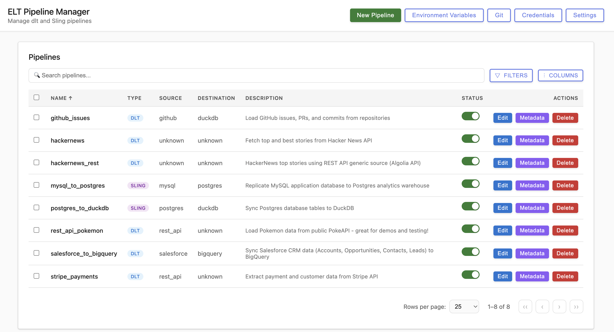

# Embedded ELT Builder

A powerful tool for creating, managing, and deploying ELT pipelines using [dlt](https://dlthub.com/) and [Sling](https://slingdata.io/). Features both a CLI and a modern web UI with dark mode support.

## Screenshot



*The Web UI showing the pipeline management interface with search, filtering, and bulk operations*

## Features

### 🎨 Web UI
- **Interactive Pipeline Creation** - Visual form-based pipeline configuration
- **Metadata Management** - Edit tags, kinds, owners, and schedules
- **Git Integration** - Commit, push, and sync with GitHub repositories
- **Dark Mode** - Full dark theme support for comfortable viewing
- **Icon Mode** - Compact icon-based interface option
- **Credential Testing** - Test database and API connections before deployment
- **Bulk Operations** - Enable, disable, or delete multiple pipelines at once
- **Advanced Filtering** - Search and filter pipelines by tool, source, destination, status
- **Repository Browser** - Browse and select pipeline directories

### 💻 CLI
- **Scaffold Pipelines** - Generate new dlt or Sling pipelines from templates
- **List Pipelines** - View all configured pipelines
- **Delete Pipelines** - Remove pipelines from your repository
- **Launch Web UI** - Start the web interface from the command line

### 🔧 Supported Tools
- **dlt (Data Load Tool)** - Python-based data pipeline framework
  - REST API sources
  - Database sources (PostgreSQL, MySQL, etc.)
  - SaaS connectors (Stripe, Salesforce, GitHub, etc.)
  - Custom Python sources

- **Sling** - Fast data replication tool
  - Database-to-database replication
  - Incremental loading
  - Schema inference

## Installation

```bash
# Clone the repository
git clone https://github.com/eric-thomas-dagster/embedded_elt_builder.git
cd embedded_elt_builder

# Install dependencies (using uv or pip)
uv pip install -e .
# or
pip install -e .
```

## Quick Start

### Web UI

Launch the web interface to visually create and manage pipelines:

```bash
# Start the web UI
python -m embedded_elt_builder.web

# Or use the CLI command
elt ui
```

The web UI will open at `http://localhost:8000`

**Features:**
- Create new pipelines with interactive forms
- Configure sources and destinations
- Set up credentials and test connections
- Manage pipeline metadata (tags, kinds, owners)
- Git operations (commit, push, sync)
- Dark mode and icon mode in Settings

### CLI

The CLI provides powerful commands for managing pipelines from the terminal with rich formatted output.

#### Repository Status

Check git status and pipeline summary:

```bash
elt status
```

Shows:
- Current branch and remote
- Uncommitted changes and files
- Commits ahead/behind remote
- Pipeline counts by tool and status

#### List Pipelines

List all pipelines with filtering options:

```bash
# List all pipelines
elt list

# Filter by tool type
elt list --tool dlt
elt list --tool sling

# Filter by status
elt list --enabled
elt list --disabled
```

#### Show Pipeline Details

Display comprehensive pipeline information:

```bash
elt show my_pipeline
```

Shows:
- Basic info (name, tool, source, destination, group)
- Schedule configuration
- Owners and tags
- Asset kinds
- Retry policy

#### Create New Pipeline

Interactively create pipelines with auto tool selection:

```bash
# Create with interactive configuration
elt scaffold create github_to_snowflake \
  --source github \
  --destination snowflake

# Create with schedule
elt scaffold create stripe_daily \
  --source stripe \
  --destination duckdb \
  --schedule "0 2 * * *"

# Skip interactive prompts
elt scaffold create pg_to_bq \
  --source postgres \
  --destination bigquery \
  --no-interactive

# Specify custom options
elt scaffold create my_pipeline \
  --source rest_api \
  --destination duckdb \
  --description "My custom pipeline" \
  --group my_group \
  --no-git-commit
```

#### Enable/Disable Pipelines

Toggle pipeline execution:

```bash
# Enable a pipeline
elt enable my_pipeline

# Disable a pipeline
elt disable my_pipeline

# Skip git operations
elt enable my_pipeline --no-git-commit
```

#### Validate Pipelines

Check all pipeline configurations for errors:

```bash
elt validate
```

Validates:
- Required files exist (dagster.yaml, pipeline.py/replication.yaml)
- YAML syntax is valid
- Required fields are present
- Cron schedules are valid
- Pipeline code has run() function (dlt)

#### Delete Pipeline

Remove a pipeline:

```bash
elt delete my_pipeline

# Skip git operations
elt delete my_pipeline --no-git-commit
```

#### Launch Web UI

Start the web interface:

```bash
# Default port (8000)
elt ui

# Custom port
elt ui --port 8080

# Specify repository path
elt ui --repo-path /path/to/pipelines
```

## Project Structure

```
embedded_elt_builder/
├── cli/                    # Command-line interface
│   ├── main.py            # CLI entry point
│   ├── scaffold.py        # Pipeline scaffolding
│   ├── list_pipelines.py  # List command (with rich tables)
│   ├── show.py            # Show pipeline details
│   ├── toggle.py          # Enable/disable commands
│   ├── validate.py        # Validate configurations
│   ├── status.py          # Repository status
│   ├── delete.py          # Delete command
│   └── ui.py              # Launch web UI
├── web/                    # Web interface
│   ├── app_enhanced.py    # FastAPI backend
│   ├── templates/         # HTML templates
│   └── credentials_config.py  # Credential schemas
├── pipeline_generator.py   # Core pipeline generation logic
└── schemas/               # Data models

pipelines/                  # Generated pipelines (gitignored)
├── dlt/
│   └── {pipeline_name}/
│       ├── pipeline.py    # Pipeline code
│       ├── config.yaml    # dlt configuration
│       └── dagster.yaml   # Dagster metadata
└── sling/
    └── {replication_name}/
        ├── replication.yaml  # Sling replication config
        └── dagster.yaml      # Dagster metadata
```

## Pipeline Configuration

### dagster.yaml Format

Each pipeline includes a `dagster.yaml` file for Dagster metadata:

```yaml
enabled: true
description: "Pipeline description"
group: "pipeline_group"

kinds:
  - "dlt"              # Tool type
  - "rest_api"         # Source
  - "duckdb"           # Destination

owners:
  - "team@company.com"

schedule:
  enabled: true
  cron_schedule: "0 */6 * * *"  # Every 6 hours
  timezone: "UTC"

tags:
  team: "data-engineering"
  environment: "production"

retries: 3
retry_delay: 60
```

## Web UI Features

### Dark Mode
Toggle dark mode in **Settings** for a comfortable viewing experience in low-light environments. All modals, tables, and forms are fully styled for dark mode.

### Icon Mode
Enable icon mode in **Settings** to display compact monochrome icons instead of text labels on action buttons:
- `✎` Edit
- `⋮` Metadata
- `×` Delete
- `+` New Pipeline
- `$` Environment Variables
- `⎇` Git
- `◈` Credentials
- `⚙` Settings

### Git Integration
- **Commit & Push** - Version control your pipeline configurations
- **GitHub Sync** - Pull latest changes when your local repo is behind
- **Status Monitoring** - View uncommitted changes and branch status

### Credential Management
Test database and API connections before creating pipelines:
- Snowflake (username/password or keypair authentication)
- PostgreSQL
- MySQL
- BigQuery
- Stripe
- Salesforce
- And more...

### Advanced Filtering
- Filter by tool type (dlt/Sling)
- Filter by enabled/disabled status
- Search across pipeline names, sources, destinations
- Sortable columns
- Customizable column visibility
- Pagination support

## Integration with Dagster

This tool is designed to work with the [dagster_elt_project](https://github.com/eric-thomas-dagster/dagster_elt_project) component, which:

1. Discovers pipelines from a GitHub repository
2. Creates Dagster assets for each pipeline
3. Executes dlt and Sling pipelines
4. Captures metadata (row counts, data sizes, source code links)
5. Organizes assets by kinds for filtering

### Workflow

1. **Create pipelines** using the embedded_elt_builder (CLI or Web UI)
2. **Commit and push** to GitHub
3. **Deploy** dagster_elt_project to Dagster Cloud
4. **Configure** the component to point to your pipelines repository
5. **Run** the refresh sensor to discover new pipelines
6. **Execute** pipelines as Dagster assets

## Configuration

### Environment Variables

Set credentials in a `.env` file in your pipelines directory:

```bash
# Database connections
POSTGRES_HOST=localhost
POSTGRES_PORT=5432
POSTGRES_USER=user
POSTGRES_PASSWORD=password
POSTGRES_DATABASE=mydb

# Snowflake
SNOWFLAKE_ACCOUNT=myaccount
SNOWFLAKE_USER=user
SNOWFLAKE_PASSWORD=password
SNOWFLAKE_WAREHOUSE=warehouse
SNOWFLAKE_DATABASE=database

# API Keys
STRIPE_API_KEY=sk_test_...
GITHUB_TOKEN=ghp_...
```

### Repository Path

Configure the repository path in the Web UI:
1. Click **Settings** (⚙)
2. Browse or enter your pipelines directory path
3. Click **Apply & Reload**

## Development

### Running Locally

```bash
# Install in development mode
pip install -e .

# Start web UI with auto-reload
uvicorn embedded_elt_builder.web.app_enhanced:app --reload --port 8050

# Or use the CLI
python -m embedded_elt_builder.web
```

### Project Dependencies

- **FastAPI** - Web framework
- **Jinja2** - Template rendering
- **GitPython** - Git operations
- **Pydantic** - Data validation
- **click** - CLI framework
- **rich** - Beautiful terminal formatting

## License

MIT License

## Contributing

Contributions welcome! Please open an issue or submit a pull request.

## Support

For questions or issues:
- Open an issue on GitHub
- Check the [dagster_elt_project](https://github.com/eric-thomas-dagster/dagster_elt_project) for deployment documentation

---

Built with ❤️ using Claude Code
